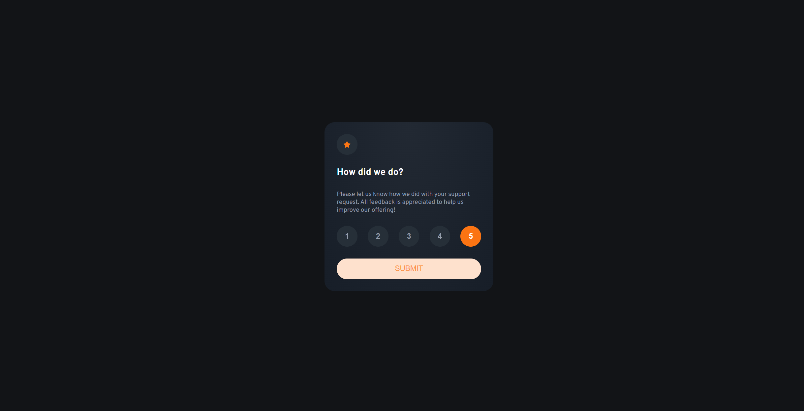
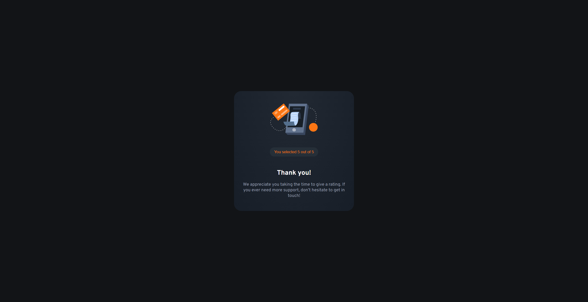
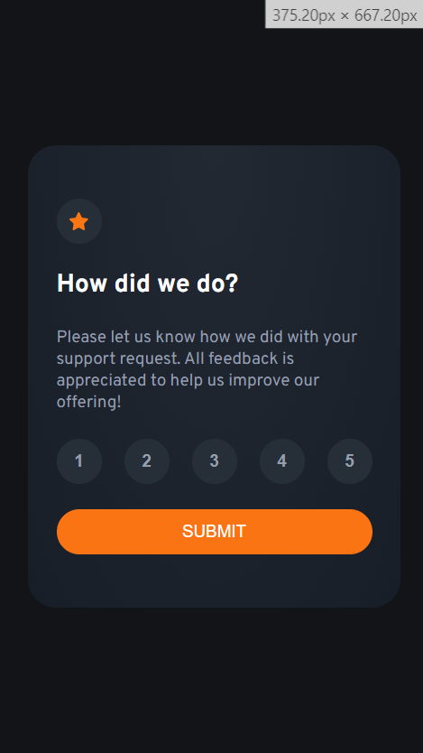
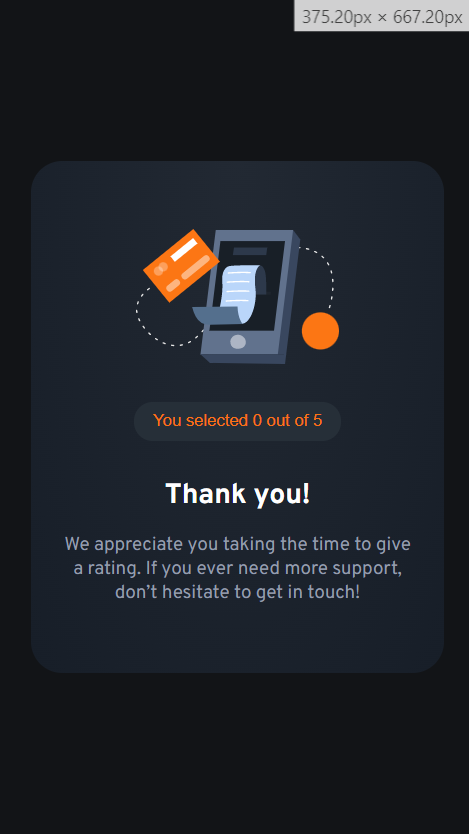

# Frontend Mentor - Interactive rating component solution

This is a solution to the [Interactive rating component challenge on Frontend Mentor](https://www.frontendmentor.io/challenges/interactive-rating-component-koxpeBUmI). Frontend Mentor challenges help you improve your coding skills by building realistic projects. 

## Table of contents

- [Overview](#overview)
  - [The challenge](#the-challenge)
  - [Screenshot](#screenshot)
  - [Links](#links)
- [My process](#my-process)
  - [Built with](#built-with)
  - [What I learned](#what-i-learned)
- [Author](#author)


## Overview

### The challenge

Users should be able to:

- View the optimal layout for the app depending on their device's screen size
- See hover states for all interactive elements on the page
- Select and submit a number rating
- See the "Thank you" card state after submitting a rating

### Screenshot







### Links

- Solution URL: [https://github.com/franekbu/Frontend-mentor-interactive-rating-component-main]
- Live Site URL: [Add live site URL here](https://your-live-site-url.com)

## My process

### Built with

- Semantic HTML5 markup
- CSS custom properties
- Flexbox
- CSS Grid
- Mobile-first workflow
- JavaScript

### What I learned

I have learned other JS things such as this:
```js
RATE_BUTTONS.forEach( (button, number) => {
    button.addEventListener('click', () => {
        clientRate = number + 1 // number to miejsce w tablicy wiec musimy dodac 1 by miec ocenę
    })
})
```
before durnig doing my gallery project,
but something I had to learn to this is this:
```js
RESULT.innerText = (clientRate)
```
I'm happy that i finally know how to (even on easy level) changing my site's conent

## Author

- Frontend Mentor - [@franekbu](https://www.frontendmentor.io/profile/franekbu)

